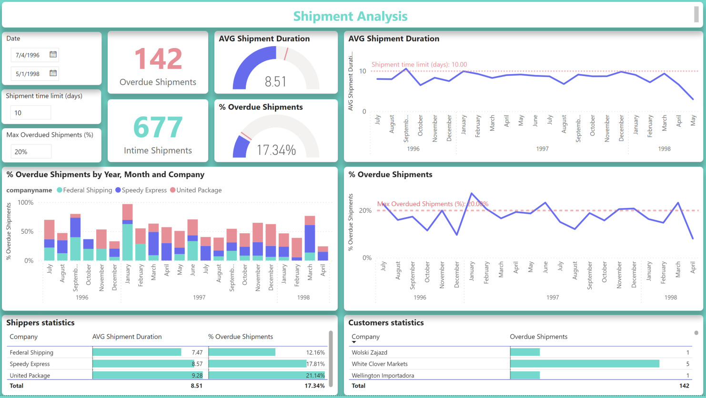

# Sale-and-Shipment-Analysis

## 1. Abstract
This dashboard presents key insights, offering a comprehensive overview of sales and shipment performance in Power BI.
  - The Sales Performance Dashboard showcases sales trends over recent years while providing detailed insights into the sales team's performance. Track employee progress and performance through Year-over-Year (YoY) reports on top-performing sales executives, measured by revenue generated and units sold. Additionally, analyze individual sales locations using interactive maps, covering countries and top regional customers.

  - The Shipment Performance Dashboard provides an in-depth analysis of annual shipping performance. Gain a clear overview of shipment delays and better understand high-value customers to optimize operations and strengthen business relationships.

## 2. Data source
Originally crafted by Microsoft, the Northwind database has served as a sample database foundation for their instructional materials across a range of database products for numerous years. Within the Northwind database lies the sales data of the fictional enterprise "Northwind Traders," engaged in the global import and export of specialty foods.
And here is the link: [HERE](https://drive.google.com/drive/folders/1sNHbkw6k1TcuiePujyqh3pWCCi9CXa9c?usp=drive_link)

## 3. Methodology
### a. Data Model
Firstly, I need to import all the tables into Power BI. Then, check all the relationships that were automatically created is correct or not. The **orders** table in this dataset is a fact table, and the others are dimension tables.
### b. Creating a calendar table
Because this data is analyzed based on dates so much, it is necessary to create a calendar to manage all dates for all tables. I used DAX to create it because the structure contains a lot of Date columns.
### c. Using DAX to create new measures and columns
Using DAX functions, such as count, sum, calculate, if and Date-time function to create measures and columns before analysis.

## 4. Visualization
To visualize this data, I used a variety of charts and tools so that people can have the most intuitive view of the business's operations:
### Cards
  - Showing total revenue
  - AOV (Average Order Value)
  - Number of orders
  - Illustrating overdue and intime shipments
### Slicers
Representing the date time information
### Charts
  - Line chart for Total Revenue by Year & Month, Revenue YTD and YoY% by Year & Month, AVG Shipment Duration, % Overdue Shipments.
  - Percent stacked column chart for the Revenue from New and Old Customers by Year and Month, the % Overdue Shipments by Year, Month & Company.
  - Map for the Count of Orders by Region.
  - Gauge charts for AVG Shipment Duration & % Overdue Shipments.
  - Table for Sale team performance, Shippers and Customers information.
### Tooltips
I used tooltips to create a dynamic dashboard to show:
  - Showing the distribution of Revenue from New and Old customers.
  - Showing an Employee's information.
### Parameters
To facilitate the analysis of sales and shipment performance in different scenarios, I created parameters for Max % of Overdue shipments and Max Shipment Duration Target with slicers.

## 5. Dashboard
### Sales performance analysis

Here are some noticeable details in this analysis:
  - **Total Revenue** was **$1.27M**, with an **AOV** of **$1.53K** and a total of **830** orders
  - Revenue has been trending up over time, with some small dips but quickly recovering
  - Top 3 revenue earners: Margaret Peacock, Janet Leverling, and Nancy Davolio contribute significantly to total revenue
  - Revenue from new customers vs. old customers:
      - In the period 1996-early 1997, the company may have been in the market expansion phase, so revenue from new customers was the main source.
      - After the company had a loyal customer base, these customers continued to buy and created a very stable source of revenue. Showing that the company's customer retention strategies were implemented very well.

### Shipment analysis

 - The **total number of overdue shipments** was **142**, representing 17.34% of all shipments
 - The **average delivery time** was **8.51** days, with some orders exceeding the allowed time limit (10 days).
 - Carrier with the highest rate of late deliveries:
   - **United Package** had the highest rate of late deliveries (**21.14%**).
   - **Federal Shipping** had the best delivery performance, with only **12.16%** of orders being late.
 - Late delivery trends over time:
   - The rate of late orders fluctuated from month to month, with some periods showing a spike.
   - Factors such as peak seasonality, warehouse capacity, or individual carrier performance may be considered.
### Recommendations
- Optimize the sales process, specifically:
  - Focus on supporting low-revenue sale teams to improve performance.
  - Maintain retention programs while continuing to expand the customer base.
- Improve shipment performance:
  - Consider discontinuing the partnership with **United Package** or discuss improving their service to reduce late delivery rates.
  - Optimize internal order processing times to avoid late deliveries.
